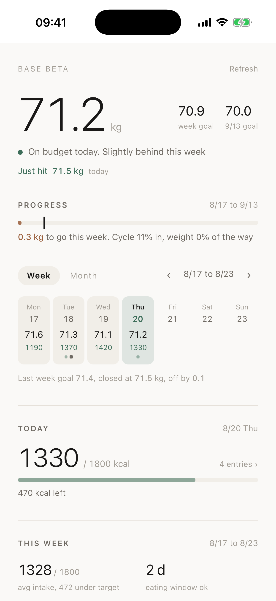

# Base

A single-file weight and food dashboard. You log by sending a photo of your meal to an AI
assistant, it estimates the calories and writes them into a JSON file, and this page draws it.

**Live demo (fake data):** https://chouhsuan1202.github.io/base-dashboard/



## What it does

- One big number: your latest weight, plus this week's goal and the goal four weeks out
- **Rolling goals.** No fixed deadline. Every Monday the plan re-anchors on where you
  actually are and asks for the same weekly drop again, so the target is always ahead of you
  and never looser than your current weight
- **Meals with nutrition tags.** Each entry is tagged protein / veg / fruit / grains / dairy,
  or flagged as empty calories. The day view shows what you got and what you missed
- **Eating window.** First bite to last bite, with a deadline if you are doing 16:8
- Week and month calendars, weight trend with a goal corridor, body composition, milestones

## How it works

```
data.json  +  template.html  --build.py-->  index.html
```

That is the whole thing. No framework, no build tools, no dependencies beyond Python 3.
The output is one self-contained HTML file with no external requests, so you can host it
anywhere static or open it from disk.

```bash
python3 build.py        # writes dashboard.html and index.html
open index.html
```

## Make it yours

1. Edit `config` at the top of `data.json`: your starting weight, calorie budget,
   weekly loss target, eating window, gym target
2. Delete the sample `entries` and start adding your own
3. Run `python3 build.py` after every change

An entry looks like this:

```json
{
  "date": "2026-08-20",
  "weight_kg": 71.2,
  "meals": [
    {"time": "10:19", "desc": "Greek yogurt with berries", "kcal": 280,
     "source": "photo", "nutri": ["dairy", "fruit"]},
    {"time": "21:00", "desc": "Bag of chips", "kcal": 270,
     "source": "photo", "junk": true}
  ],
  "gym": false,
  "body": {"fat_pct": 27.4, "muscle_kg": 49.4, "bmr": 1540},
  "note": ""
}
```

`nutri` and `junk` are mutually exclusive. Everything except `date` is optional.

## Logging by photo

The dashboard does not capture anything itself. The workflow that makes it usable is:
point an AI coding assistant at your copy of this repo, then send it meal photos. Tell it to
estimate the calories, tag the nutrition, append to `data.json`, run `build.py`, and push.
The photo timestamp becomes the meal time, so you never type anything.

Deploy the output to any static host (Cloudflare Pages, GitHub Pages, Netlify) and add it to
your phone home screen. `manifest.json` and `sw.js` make it behave like an app.

## Notes

- Weekly results are judged on the last actual weigh-in of that week, not a moving average.
  The average is shown for context but a goal you cannot see yourself hitting is demotivating
- Past weeks keep the goal they had at the time. History does not get rewritten
- The sample data in this repo is generated, not real

MIT licensed. Built with Claude Code.
